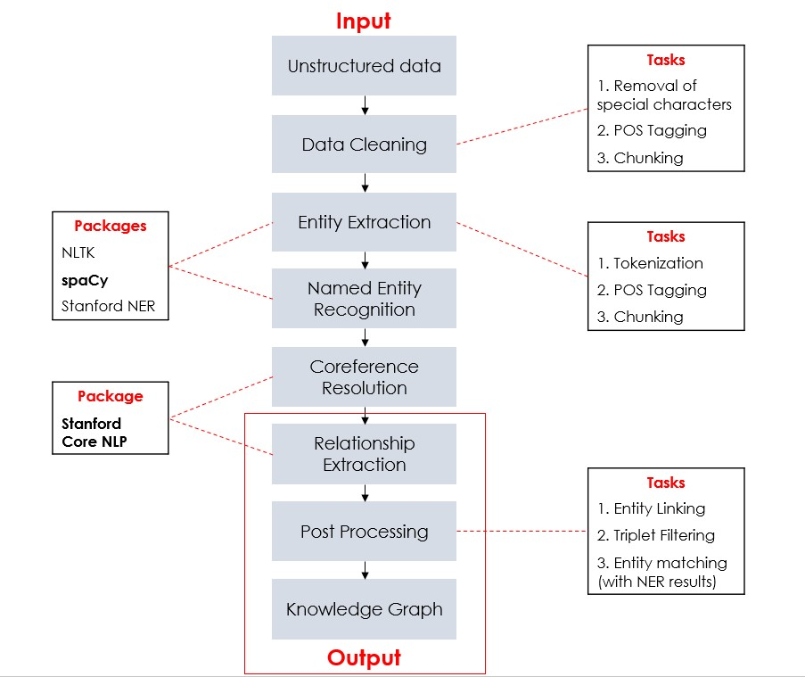

## **Complete Pipeline**

**1.    Unstructured text**

The model first reads the unstructured text as it is.  
All files are read from the data/input folder

**2.	Data cleaning**

Some ramifications are needed for the raw text to be processed by the model
*	Normalization
*	Removing special/unwanted characters & Punctuation handling
*	Removing acronyms

#Note - Stop words removal affects performance negatively  
Tested pretext tasks - Paraphrasing, Abstractive Summarization - No significant benefit

**3.	Entity Extraction** 

In order to extract the entities, the model performs some pretext tasks

*	Tokenization: Splitting a sentence into each individual word
*	POS Tagging: Identifying the part of speech that the word constitutes, i.e., explains how a word is used in a sentence. There are eight main parts of speech - nouns, pronouns, adjectives, verbs, adverbs, prepositions, conjunctions, and interjections.
*	Chunking: Chunking is a process of extracting phrases from unstructured text. Instead of just simple tokens which may not represent the actual meaning of the text, it’s advisable to use phrases such as “South Africa” as a single word instead of ‘South’ and ‘Africa’ separate words. Chunking works on top of POS tagging, it uses pos-tags as input and provides chunks as output.

**4.	Named Entity Recognition**

Refers to the task of identifying and categorizing key information (entities) in text.
I tested 3 open-source packages for the same:
*	SpaCy NER  Best
*	Stanford NER
*	NLTK 

**5.	Coreference Resolution**

Refers to the task of finding all expressions that refer to the same entity in a text. 
Example: John ranked first in his class. He also was the captain of the football team. 
Identifying He = John is coreference resolution.

**6.	Relationship Extraction**

The pipeline uses [Stanford's OpenIE](https://nlp.stanford.edu/software/openie.html) for information extraction.
This is an implementation of the paper Gabor Angeli, Melvin Johnson Premkumar, and Christopher D. Manning. [Leveraging Linguistic Structure For Open Domain Information Extraction](https://nlp.stanford.edu/pubs/2015angeli-openie.pdf). In Proceedings of the Association of Computational Linguistics (ACL), 2015.

Steps perrformed by OpenIE:
*	Step 1: Splits each sentence into a set of entailed clauses. 
*	Step 2: Each clause is then maximally shortened, producing a set of entailed shorter sentence fragments. 
*	Step 3: These fragments are then segmented into OpenIE triples, and output by the system.

The central difference from other information extraction is that the schema for these relations does not need to be specified in advance; typically, the relation's name is just the text linking two arguments.

**7.	Post Processing**

This step involves formatting the output to a desired structure to enable effective visualization and understanding.
The tasks performed in the backend are:
*	Entity Linking: Matching the overlapping entity names.  
    E.g. Identifying Wun Tian Dian and Wun as the same entity
*	Triplet Filtering: Ensuring the triplets are valid and contain entities obtained during NER step

**8.	Knowledge Graph**

## **File structure**

**data/**
 - input - Place the input files here
 - ner - Will contain intermediary files generated by the code
 - kg - Will contain intermediary files generated by the code
 - output - Will contain intermediary files generated by the code
 - results - Output files will be available here

**utils.py** - Contains supplementary code for the implementation - Input data retrieval and cleaning

**build_components.py** - Performs Entity Extraction, Named Entity Recognition and Coreference Resolution

**knowledge_graph.py** - Performs Relationshp Extraction, Post Processing and outputs the Knowledge Graph 
